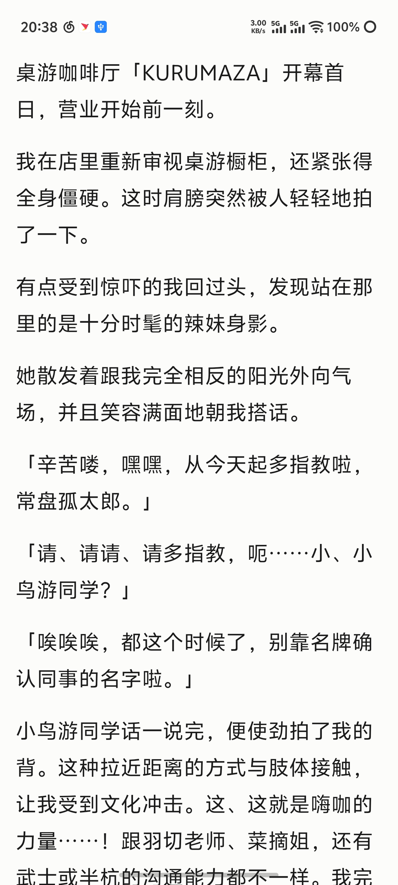
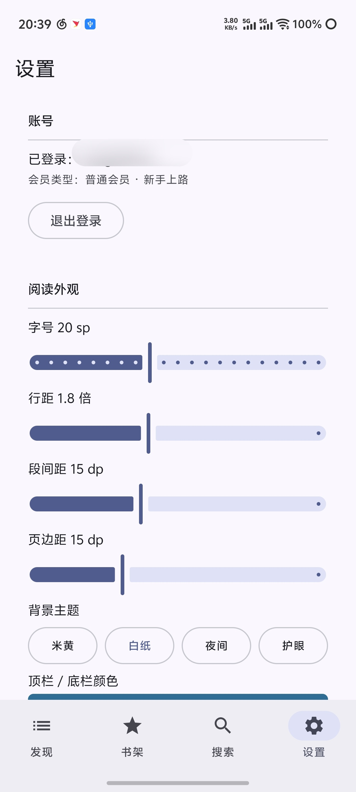
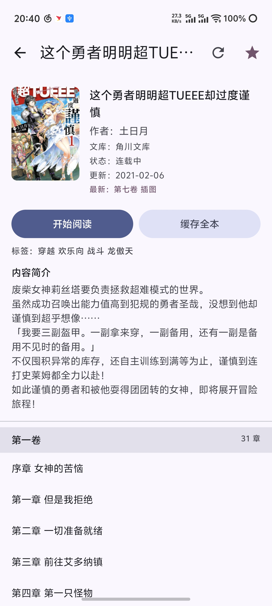

# Light Novel Reader

一个源于Wenku8轻小说网站的Android轻小说阅读器，但不使用api，本质上是“操作”浏览器进行阅读。

**整体框架**：UI 已成型、可跑通「登录 → 找书 → 看目录 → 阅读 → 记进度 → 离线缓存」的完整链路。

当前只接入[轻小说文库](https://www.wenku8.net/)书源。

**当前版本**：`v0.1.2-alpha`（第三个预发布版）。

## 目录

- [1. 做这个项目的灵感](#1-做这个项目的灵感)
- [2. 页面展示](#2页面展示)
- [3. 功能说明](#3-功能说明)
- [4. 快速开始](#4-快速开始)
- [5. 目录结构](#5-目录结构)
- [6. 分层与数据流](#6-分层与数据流)
- [7. 书源映射（wenku8）](#7-书源映射wenku8)
- [8. 抓取策略与边界](#8-抓取策略与边界)
- [9. 测试](#9-测试)（含 [Compose 预览](#compose-预览preview不是测试但同样不跑设备)）
- [10. 已知限制（有意为之）](#10-已知限制有意为之)
- [11. 验证记录](#11-验证记录)
- [12. 许可与使用边界](#12-许可与使用边界)

---

## 1. 做这个项目的灵感

出于探索，于是我斥点小资用AI（主要用的Deepseek v4.1 Flash，最新出的这个模型确实快）做一个类似的app，至少基本功能都有，不过有些功能还在开发中，欢迎在issue反馈或者提交PR，如果有可行的方案我会尝试。

**已实现内容（后续会继续更新）**：

- [x] 搜索功能（支持搜索历史）
- [x] 主页面深色模式切换
- [x] 字体调整
- [x] 阅读背景调整
- [x] 网站源与设备书架同步
- [x] 历史同步（但目前仅支持具体到第x卷）
- [x] 轻小说txt下载（站点整本打包，见 §8.2）
- [ ] 轻小说排行榜下拉加载
- [ ] 本地书签bookmark
- [ ] 简繁切换
- [ ] 翻页模式（当前内置翻页存在bug）
- [ ] 自动更新
- [ ] ……

---

## 2.页面展示



## 3. 功能说明

- 当前只接入轻小说文库（wenku8）书源
- 登录方式：原生表单 / 浏览器登录（人机校验）/ 手动粘贴 Cookie
- 发现页：榜单与最近更新
- 搜索：标题/作者搜索 + 搜索历史
- 书籍详情：封面、元信息、卷章目录、缓存全本、**下载全本（站点打包 txt）**
- 书架：继续阅读（本地阅读记录）/ 在线书架 / **已缓存**（本机已下载章节）/ **已下载**（站点打包的整本）；同步结果与补全提示显示在页面底部
- 阅读器：翻页阅读 + 目录跳转 + 阅读设置面板 + 章节切换横幅提示 + 音量键翻页（含反转）；进入阅读时隐藏系统状态栏，返回时自动恢复
- 设置：账号管理、阅读外观（顶底栏配色、音量键翻页）、深色模式、存储管理（离线章节 / 整本下载 / 图片缓存）、书源说明、开发者页（跳转项目 GitHub 主页）
- 所有页面的刷新按钮限速 2 秒/次，以避免频繁发送请求：窗口内的重复点击被静默忽略，不弹「刷新过快」提示

## 4. 快速开始

```bash
.\gradlew.bat assembleDebug          # 构建 debug APK
.\gradlew.bat installDebug           # 安装到已连接设备/模拟器
.\gradlew.bat test                   # JVM 单元测试（192 个）
.\gradlew.bat connectedAndroidTest   # 设备测试（8 个）
```

| 组件 | 版本 |
|---|---|
| Gradle / AGP | 9.4.1 / 9.2.1 |
| Kotlin | 2.2.10 |
| Compose BOM | 2026.02.01 |
| compileSdk / minSdk | 36.1 / 26 |
| JVM toolchain | 21 |

版本统一在 `gradle/libs.versions.toml`，不要在 `app/build.gradle.kts` 里写死。

---

## 5. 目录结构

```
app/src/main/java/com/xempastissimo/lightnovelreader/
├─ App.kt                          Application，持有 AppContainer
├─ MainActivity.kt                 唯一 Activity：主题 + 注入 + NavHost
│
├─ core/                           与被抓站点无关的底层工具
│  ├─ html/Html.kt                 自研极简 DOM（容错分词 + 实体解码）
│  ├─ html/CssSelector.kt          选择器子集引擎
│  ├─ text/CharsetCodec.kt         charset 探测与解码（GBK 兜底）
│  ├─ text/TextCleaner.kt          文本清洗（单行化 / 分段）
│  └─ json/Json.kt                 自研 JSON 编解码（用于本地持久化）
│
├─ data/
│  ├─ network/HttpFetcher.kt       HttpURLConnection 封装：编码、Cookie、重试
│  ├─ network/CookieStore.kt       持久化 cookie jar（JSON + 锁）
│  ├─ network/RateLimiter.kt       串行限流 + 指数退避
│  ├─ network/RefreshThrottle.kt   刷新按钮的 2 秒/次限速（静默丢弃窗口内的重复点击）
│  ├─ source/BookSource.kt         书源接口（榜单/目录/详情/正文/在线书架/整本打包；`bookSummary` 只取详情页元信息）
│  ├─ source/wenku8/               首个书源的全部实现
│  │  ├─ Wenku8Urls.kt             URL 模板 / 解析工具（含下载站 `dl.wenku8.com`）
│  │  ├─ Wenku8Selectors.kt        选择器回退链（改版只改这里）
│  │  ├─ Wenku8Parser.kt           HTML → 领域模型
│  │  ├─ Wenku8PackParser.kt       整本打包 txt → 章节字节切片（纯函数，见 §8.2）
│  │  └─ Wenku8Source.kt           BookSource 实现
│  └─ repo/                        对界面暴露的仓库层
│     ├─ BookRepository.kt         详情缓存 + 章节离线读写 + 逐章缓存 + 整本下载编排
│     ├─ PackStore.kt              整本打包文件与索引（`filesDir/packs/`，见 §8.2）
│     ├─ ShelfRepository.kt        本地书架 / 阅读进度 / 搜索历史 / 元信息合并
│     ├─ SettingsRepository.kt     DataStore 偏好设置
│     └─ ImageLoader.kt            自研图片加载（内存 LRU + 磁盘 + Referer）
│
├─ domain/model/Models.kt          Book / Volume / Chapter / ChapterContent / ReadingProgress
│
└─ ui/
   ├─ AppContainer.kt              手写 DI 根 + CompositionLocal
   ├─ ViewModelSupport.kt          ViewModel 工厂 + 错误 → 文案
   ├─ navigation/AppNavHost.kt     路由表 + 底部导航
   ├─ component/                   CoverImage / BookCard / BookRow / ShelfRow / 空态
   ├─ theme/                       纸张配色 + 阅读器专用配色
   └─ screen/
      ├─ discover/                 榜单与最近更新
      ├─ search/                   标题/作者搜索 + 历史
      ├─ detail/                   封面、元信息、卷章目录、缓存全本、整本打包下载
      ├─ shelf/                    继续阅读（本地阅读记录）/ 书架（**只显示站点账号里的收藏**）/ 已缓存（本机已缓存的章节）/ 已下载（站点打包的整本）；`ShelfContent.kt` 是无状态渲染半，`ShelfFilters.kt` 决定每个页签的行从哪来，`ShelfScreenPreviews.kt` 放整屏 `@Preview`（多状态下拉）
      ├─ settings/                 账号、阅读外观（含顶底栏配色、音量键翻页与反转）、深色模式、存储、书源说明、开发者页；`SettingsScreenPreviews.kt` 放整屏 `@Preview`（多状态下拉）
      ├─ login/                    原生表单 + 浏览器登录（人机校验）+ 粘贴 Cookie
      └─ reader/                   翻页阅读器 + 目录 + 阅读设置面板 + 章节切换横幅提示
```

---

## 6. 分层与数据流

```
Compose Screen ──> ViewModel ──> Repository ──> BookSource(Wenku8) ──> HttpFetcher
                                     │                                     │
                                     ├─ ChapterCache（离线章节）            ├─ CookieStore
                                     ├─ PackStore（整本打包 txt + 索引）    └─ RateLimiter
                                     ├─ ShelfRepository（书架/进度）
                                     └─ ImageLoader（封面/插图）
```

- **UI 不直接联网**：所有网络与缓存都经过仓库层，界面只消费 `StateFlow`。
- **`BookSource` 是唯一抽换点**：`AppContainer.bookSource` 换成别的实现即可接新站。
- **错误是显式类型**：`HttpFailure` 区分限流、会话失效、人机校验、网络故障，UI 直接给出对应文案。

---

## 7. 书源映射（wenku8）

下表是**在真实站点上核实过**的页面结构（登录后逐页用浏览器 DOM 探查），改版时按它对照 `Wenku8Selectors.kt`。

### 7.1 URL

| 用途 | 形式 |
|---|---|
| 详情页 | `/book/{aid}.htm` |
| 目录页 | `/novel/{cat}/{aid}/index.htm`（详情页「阅读 → 小说目录」按钮的链接） |
| 章节页 | `/novel/{cat}/{aid}/{cid}.htm` |
| 榜单 | `/modules/article/toplist.php?sort={allvisit,monthvisit,dayvisit,anime,postdate,goodnum,lastupdate}` |
| 完结目录 | `/modules/article/articlelist.php?fullflag=1` |
| 搜索 | `/modules/article/search.php?searchtype={articlename,author}&searchkey={GBK 编码}` | 与榜单同一套条目结构（结果行自带封面），因此走同一个解析器 |
| 在线书架 | `/modules/article/bookcase.php` |
| 书架分组 | `?classid=1` … `?classid=5`（连同默认组共 6 组）。**app 暂不呈现分组**，只读写默认组；页头的总数涵盖全部分组，所以计数是全账号的，只有列表是默认组的 |
| **移出一本** | `/modules/article/bookcase.php?delid={shelfId}` —— 页面每行的「移除」就是这个地址（`document.location` 写在 `javascript:` href 里）。**`shelfId` 不是书籍 id**，见「两个 id」 |
| **批量移出** | 提交页面自带的 `<form action="" method="post" id="checkform">`：`checkid[]`（每个勾选项的 `shelfId` 各出现一次）+ `newclassid=-1`（`-1`＝移出书架，`0`～`5`＝移到分组）+ 表单隐藏字段 `clsssid` + 提交按钮 `btnsubmit`。字段名全部从页面读出，不写死 |
| 加入书架 | `/modules/article/addbookcase.php?bid={aid}` —— 这里的 `bid` **就是书籍 id**，与移出时的同名字段含义不同；先取页面自身的 `a[href*=addbookcase]`，取不到才退回该地址 |
| 登录 | `/login.php?do=submit&jumpurl=...` |
| 书架上限 | 页头写着「您的书架可收藏 300 本」，由站点强制；`Wenku8Source.MAX_BOOKCASE_BOOKS` 只是页头读不到时的兜底 |
| 整本下载页 | `/modules/article/packshow.php?id={aid}&type=txtfull` —— **需要登录**，且对非浏览器客户端返回 403 质询。app **不读它**：页面上只有一条备注（「如遇载点一无法下载，请尝试使用载点二」）和下面这些链接，没有独有信息 |
| **整本打包下载** | 另一个主机：`https://dl.wenku8.com/down.php?type={txt,utf8,big5}&node={1,2}&id={aid}`。`type=txt`＝简体 GBK，`utf8`＝简体 UTF-8，`big5`＝繁体；`node` 是页面上的载点一/载点二。**只有 `id` 是书籍 id**，与书架 id 无关 |
| 打包文件形态 | 纯文本，单文件整本：第 1 行站点横幅，第 2 行 `<书名>`，之后**章节标题顶格**、正文行 4 个半角空格缩进、空行分段；插图为单独一章但**正文为空**（不含图片，与站点自己的 txt 一致） |

> `dl.wenku8.com` 与 `www.wenku8.net` 的行为完全不同，这一点在真站核实过：它对普通 HTTP 客户端（`HttpURLConnection`，**不带任何 Cookie、不带 Referer**）返回 `200 application/octet-stream` 与完整文件（2231 的 UTF-8 包 6,778,311 字节 / GBK 包 4,678,363 字节），没有任何 Cloudflare 质询；不存在的书返回 `404`。响应是 `Transfer-Encoding: chunked` 且**没有 `Content-Length`**，所以下载进度只能是不确定进度条。

### 7.2 选择器

| 数据 | 定位方式 | 备注 |
|---|---|---|
| 正文容器 | `div#content` | 章节页与详情页共用 |
| **书籍目录链接** | 详情页「阅读」fieldset 内 `a[href$=index.htm]`，形如 `/novel/3/3988/index.htm` | **这是 `cat` 段的权威来源**：`cat` 只出现在 `/novel/{cat}/{aid}/…` 里，不能从 `/book/{aid}.htm` 推出 |
| 目录表 | `div#content table.css` | 卷标题在 `td.vcss`，章节在 `td.ccss > a` |
| 正文排版 | 裸文本 + `<br>` | **正文不在元素里**：`#content` 的直接文本节点用 `<br>` 分段 |
| 章节内插图 | `#content img[src]` | 插图章节单独成页 |
| 封面 | 详情页 `img[src*=image]`；无图时按分类段推导 | 形如 `http://img.wenku8.com/image/{cat}/{aid}/{aid}s.jpg`。**中段是书籍 id 本身**（不是 `aid/1000`），`cat` 只能取自 `/novel/{cat}/{aid}/…`（见上一行）；已在真站核实：`image/3/3988/3988s.jpg` 为 200，`image/3/3/3988s.jpg` 为 404 |
| 最近更新封面 | 首页「最近更新」行**不含 ``** | 行内只有 `[文库] 《书名》 最新章节`（`/book/{aid}.htm` + `/novel/{cat}/{aid}/{cid}.htm`），因此封面由最新章节链接里的 `cat` 推导；若站点日后补上图片，`img[src*=image]` 优先 |
| 标签 | `span.hottext b` 中 `作品Tags：` 之后 | |
| 简介 | `内容简介：` 标签**紧邻的下一个兄弟块** | 标签自身只是占位 span，值是相邻的裸文本 |
| 最近章节 | `最近章节：` 标签的下一个兄弟块 | |
| 作者/文库/状态/更新 | 按 `小说作者：`、`文库分类：`、`文章状态：`、`最后更新：` 标签定位所在 `td` | 与简介**不在同一张表** |
| 榜单条目 | `a[href*=addbookcase]` 向上找含 `img` 的容器 | 榜单整页只有一个 `table.grid`，条目是其中的 `div`。**每个条目对同一本书有两个链接**：先是一个只包着封面的空文本链接，再是带书名的链接 —— 取第一个会把条目当成无标题而整条跳过（这就是搜索/榜单曾经只剩标题、没有封面的原因），所以按「有文本且不是 `我要阅读` 之类的动作词」来选书名链接 |
| 在线书架 | `a[href*=readbookcase]`（`?aid=&bid=[&cid=]`） | `cid` 出现时该链接是最新章节 |
| 书架条目行 | 同时含 `input[name^=checkid]` 与 `a[href*=readbookcase]` 的**最近祖先**（即 `<tr>`） | 两个条件缺一不可：只看 `readbookcase` 会停在标题所在的 `<td>`（**里面没有作者**，这就是书架作者一直为空的原因），只看复选框会停在复选框自己的 `<td>` |
| 书架页头 | `div.gridtop` 的文本 | `您的书架可收藏 300 本，已收藏 3 本，本组有 3 本。` —— 真实总数只在这里 |
| 书架批量操作 | `select[name=newclassid]` 所在 `<form>` | `checkid[]`＝各行复选框的 `value`，`newclassid=-1` 表示移出书架 |
| 分页 | `div.pages` | |

#### 在线书架没有封面（书架行的元信息要合并，不能覆盖）

`bookcase.php` 是一张 名称 / 作者 / 最新章节 / 书签 / 更新 / 操作 的表格，**行内没有 ``**，也没有指向书籍自己页面的链接，所以 `parseBookcase` 只能给出书名、作者和最新章节：`coverUrl` 为 null、`文库分类`/`文章状态`/`最后更新` 全空。

后果有两条，都已修：

- **同步不能整行覆盖**。`ShelfRepository.replaceOnlineEntries` 早先用站点那一行直接替换本地行，于是「打开过详情页、已经有封面」的书会在下一次同步时丢掉封面、文库和日期。现在改为 `book.mergeInto(existing)`：站点有值的字段以站点为准（书名、最新章节），站点没提的字段保留本地已有的。
- **没打开过的书要补一次详情页**。`ShelfViewModel.backfillMissingMetadata` 在一次成功的书架同步之后，对「既没有封面、也没有文库分类和更新日期」的行各读一次 `BookSource.bookSummary`（只取 `/book/{aid}.htm`，**不读目录**），把结果落盘。它串行、受 `RateLimiter` 限速、每次最多 8 本、遇到第一个失败就停下（质询或掉登录会让后面每一本都以同样方式失败），并且会跳过本次会话里已经问过的书。
  判定条件是「详情页能补的字段**全都没有**」，而不是「没有封面」——站点确实有书没封面，只看封面会永远重试。

#### 两个 id（踩过两次的坑）

同一本书在站上有**两个不同的数字**，混用会让请求「看起来成功、其实什么都没发生」：

| 出现位置 | 名字 | 例 |
|---|---|---|
| `/book/{aid}.htm`、`/novel/{cat}/{aid}/{cid}.htm`、`addbookcase.php?bid={aid}` | **书籍 id** | `3988` |
| `readbookcase.php?aid={aid}&bid={bid}` 的 `bid`、行复选框的 `value`、`bookcase.php?delid={bid}` | **书架 id** | `13066825` |

app 内部一律用书籍 id（`Book.bookId`）。移出书架只接受**书架 id**，所以必须先用 `Wenku8Parser.parseBookcaseRowIds` 从页面读出配对，不能拿书籍 id 去拼 URL。

### 7.3 登录

- 表单字段：`username`、`password`、`usecookie`、`action=login`；提交到 `/login.php?do=submit`。
- **`usecookie` 的值是秒数**（`0` / `86400` / `2592000` / `315360000`），不是序号 —— 这点已在真站核实。
- 中文用户名/搜索词必须**按 GBK 编码**后再 URL 编码，否则服务端查不到（`Wenku8Urls.search` 已处理）。
- 站点会话 Cookie：`PHPSESSID`、`jieqiUserInfo`（含用户名/等级，`jieqiUserInfo` 存在即视为已登录）、`jieqiVisitInfo`。

---

## 8. 抓取策略与边界

- **串行 + 限速**：所有请求经过一个 `RateLimiter`，最小间隔 900ms，`429/403/5xx` 指数退避后重试，最多 3 次。
- **批量下载是串行的**：`BookRepository.downloadBook` 逐章下载并回报进度，不做并发抓取。
- **不做风控绕过**：站点对普通 HTTP 客户端返回 Cloudflare 质询（响应头 `cf-mitigated: challenge`）。
  应用**不会**伪造指纹或绕过校验，而是提供三条正规路径：
  1. 「使用浏览器登录」——在 WebView 中由用户本人完成人机校验与登录，再把会话 Cookie 导入应用；
     > 注意：WebView 默认 UA 含 `; wv)` 标记，会被站点的机器人防护直接拒绝并**永久转圈**。
     > 因此这里显式设置了普通 Chrome 的 UA（兼容性配置，非绕过手段）。
  2. 「手动粘贴 Cookie」——从已登录的浏览器复制 `PHPSESSID`/`jieqiUserInfo` 等；
  3. 「在系统浏览器中打开登录页」——登录后回到应用粘贴 Cookie，用于 WebView 被拒的场景。

### 8.1 两条传输通道与「浏览器内核」取数

本机与真机都实测到：**`HttpURLConnection` 一律 403，而应用自带的 WebView 内核能拿到页面**
（真机实测 `chars≈32827, signedIn=true, challengePage=false`）。现代 Cloudflare 校验的是
TLS/HTTP2 请求指纹，所以有效 Cookie 也不够。

因此网络层有两条通道：

| 通道 | 实现 | 用途 |
|---|---|---|
| 原生 | `HttpUrlConnectionFetcher` | 表单 POST（登录）、图片等二进制下载；快 |
| 浏览器内核 | `BrowserPageFetcher` + `BrowserBackedFetcher` | **所有 HTML 页面**（榜单、详情、目录、正文）；慢（每次新建并销毁一个 WebView），且需要应用在前台 |

`BrowserBackedFetcher` 会在拿到质询页（`<title>` 为 `Just a moment...`）时重试一次；仍被质询就
抛出 `HttpFailure.Challenge`，界面会引导用户去「浏览器登录」完成一次校验——校验通过后浏览器会话
有效，应用即可正常取数。

> 判定质询**不能靠体积**：真实质询页有 ~28KB，必须靠 `<title>` 或 `cf_chl_opt`/`challenge-platform`
> 特征（`BrowserBackedFetcher.isChallengePage`），否则会把质询页当正文解析，界面显示成空列表。
- **登录后回到「发现」页会自动重取**：`DiscoverViewModel` 记住上次取数时的会话状态，`ON_RESUME` 时**只在会话发生变化**（或上次因未登录而失败）才重新请求，因此登录 → 返回即可看到榜单与封面，普通切页不会多打请求。
- **内容边界**：离线缓存只供个人在已有访问权限内阅读，**不做导出/分享/镜像**功能，请在设置页保持知情。
- **本地会话文件的敏感性**：从 WebView 导入的 `jieqiUserInfo` 按站点设计**包含一个口令哈希**（`jieqiUserPassword=…`），会随其他 Cookie 一起写入应用私有的 `files/session/cookies.json`。它不会离开设备，但请在共享设备上用完「设置 → 账号 → 退出登录」清理。
- 图片走 `http://img.wenku8.com`（源站只提供 HTTP），因此 `network_security_config.xml` 只对该域名放开明文流量，其余仍强制 HTTPS。

### 8.2 整本打包下载（「已下载」页签）

书籍详情页的「下载全本（站点打包）」**一次请求**取回整本书，这与「缓存全本」是两件事：后者按章抓取，一次一页。

**地址从站点自己的下载页读出，但不读那个页面**。`packshow.php` 需要登录、对非浏览器客户端返回质询，而且页面上只有「如遇载点一无法下载，请尝试使用载点二」这条备注和几个链接——链接本身可以构造（见 §7.1）。app 因此直接用 `dl.wenku8.com`，依次尝试 **UTF-8 载点一 → UTF-8 载点二 → GBK 载点一 → GBK 载点二**；这也是这条链路唯一走**原生 HTTP 通道**的地方（该主机没有质询），其余页面仍走浏览器内核。

**下载后做两件事**（两份都留着，用户可在设置页分别清理）：

```
filesDir/packs/{bookId}/
├── text.txt       下载到的原文，逐字节保存（UTF-8 或 GBK）
└── index.json     书名/作者/封面/简介 + 当时的目录 + 每章的字节区间

filesDir/library/{bookId}/{chapterId}.json    ← 同一批章节也导入到逐章缓存
```

- **章节标题 = 目录里的「卷名 + 空格 + 章节名」**：真站核实 2231 的目录 270 章**全部对上**（`Wenku8PackParser.match`）。
- **标点必须归一化**：同一个分隔符，页面写 `•`（U+2022），打包文件写 `·`（U+00B7）。逐字比对会丢掉约 3% 的章节（该书 270 章里丢 8 章），归一化后 270/270。
- **插图章节在包里是空的**：它是标题行加几个空行，没有图片。这种章节**不记录切片**，于是阅读时回落到在线章节（在线那章有插图）。2231 因此报告 **覆盖 254/270 章**，缺的 16 章正好是全部 `插图` 章。
- **读取优先级**：逐章缓存 → 打包切片 → 网络。缓存优先是因为在线缓存可能带插图；打包其次是为了让「清理离线章节」之后已下载的书**仍然可读**。
- **离线目录**：`index.json` 里存了当时的目录，所以已下载的书在完全离线时**也能打开**（打开时不用再取一次目录）。这条只对已下载的书成立，其余书仍受 §10「离线打开仍要取一次目录」限制。
- **两个本地页签是分区的**：有打包记录的书**只**出现在「已下载」，不再出现在「已缓存」（否则同一本书会带着两套说法出现两次）。

失败形态都是显式的：`404` → 「站点没有提供这本书的打包下载」；`403`/质询 → 现有文案引导先做浏览器校验；下载中取消或进程被杀 → 只留下没有 `index.json` 的目录，下次启动会被忽略，设置页「清理整本下载」可回收。

---

## 9. 测试

### JVM 单元测试（`app/src/test`，192 个）

| 文件 | 覆盖 |
|---|---|
| `core/html/HtmlTest` | DOM 分词、选择器（含 `[href*=…]`）、实体解码、容错、`</br>` 不得截断文档树 |
| `core/json/JsonTest` | 编解码往返、嵌套、数组、转义、损坏输入返回 null |
| `core/text/CharsetCodecTest` | GBK 探测与解码、meta charset、段落清洗 |
| `data/network/CookieStoreTest` | domain/path/过期/`Max-Age`、持久化、原始 Cookie 导入、HTTP 日期解析 |
| `data/network/RateLimiterTest` | 限流间隔、退避序列、重试判定（假时钟） |
| `data/network/RefreshThrottleTest` | 刷新按钮的限速窗口：首次必过、窗口内丢弃、窗口过后放行、连点保持 2 秒下限而不被推迟（假时钟） |
| `data/source/wenku8/Wenku8ParserTest` | 详情元信息、卷章目录、正文分块、插图与导航、登录墙识别、榜单/搜索条目（含封面取哪张）、书架、最近更新解析、封面推导、URL 工具 |
| `data/source/wenku8/Wenku8PackParserTest` | 打包文本的行扫描与字节切片、UTF-8/GBK、CRLF 与全角缩进、`•`/`·` 归一化、重名章节按序消耗、插图章节「有标题无正文」、目录里有而包里没有 / 包里有而目录没有、切片不重叠 |
| `data/source/wenku8/Wenku8SourceEndToEndTest` | 假 HTTP 层下的完整取数：书架总数与批量移除表单、详情→目录→正文、`bookSummary` 只读详情页而不读目录 |
| `data/repo/ShelfRepositoryMergeTest` | 站点书架镜像与本地阅读记录的合并、增删与重载；同步**保留**站点页面没带的封面/文库/日期，`updateBook` 只补元信息、不动进度与缓存 |
| `data/repo/ChapterCacheOfflineBooksTest` | 「已缓存」的书单来自磁盘：章节数与占用、`.json.tmp` 与空文件不算数、非书籍 id 目录忽略 |
| `data/repo/PackStoreTest` | `text.txt` + `index.json` 往返、按字节区间读回章节、截断的包不产生半章、GBK 按记录的解码、删除/清空、损坏或无索引的目录被忽略、按下载时间排序 |
| `data/repo/BookRepositoryPackTest` | 下载→导入→记录；读取优先级（缓存 → 打包 → 网络）与「清理离线章节后仍可读」；`cachedChapterIds` 合并打包切片；删包/删本机副本后的回落；离线目录兜底；不支持整本下载的书源 |
| `ui/screen/shelf/ShelfFiltersTest` | 四个页签的行来源与排序；有打包记录的书不出现在「已缓存」；没有书架行的下载书用记录里的元信息成行并保留进度 |
| `ui/screen/reader/ChapterTurnTest` | 越界滑动是否翻章、翻章方向的判定、章节切换分类逻辑 |
| `ui/screen/reader/VolumeKeyPageStepTest` | 音量键翻页的默认方向与「反转音量翻页」的互换、其他按键不参与 |

解析类测试使用**结构等价、文案中性**的片段（与真实页面的标签/类名/嵌套一致），不保存站点正文。

### Compose 预览（`@Preview`，不是测试但同样不跑设备）

界面改动可以完全在 Android Studio 的 Preview 面板里调，不必装到手机上。为此每个界面被拆成两半：

```
settings/
├─ SettingsScreen.kt           有状态外壳 SettingsScreen()（取 ViewModel）+ 无状态 SettingsContent(state, actions)
└─ SettingsScreenPreviews.kt   整屏预览（4 个状态 × 浅色/夜间）
```

`@Preview` 拿不到 `ViewModel`，所以**只有无状态的那半能预览**——这就是拆分的原因。预览分两类放置：

| 位置 | 内容 | 面板里的名字 |
|---|---|---|
| 组件文件末尾（`SettingsCard`、`SwitchRow`、`BookCard`…） | 叶子组件 | 「分区卡片 · 浅色」「分区卡片 · 夜间」「开关 · 开」「开关 · 关」…… |
| 独立的 `*Previews.kt` | 整屏、多状态 | 「设置 · 未登录」「设置 · 已登录」「设置 · 夜间」…… |

- 多状态用 `@PreviewParameter` 提供：面板顶部的下拉框直接切换「未登录 / 已登录 / 诊断失败 / 调过栏色」四种假状态，**不改代码**。
- 夜间配色用 `uiMode = Configuration.UI_MODE_NIGHT_YES` 复制一份预览，于是同一次改动能在浅色和夜间并排看。
- 预览里**固定 `dynamicColor = false`**：动态取色来自用户壁纸，用它预览会让每台机器的颜色都不一样，判断不了对比度。预览用应用自己的纸张配色。
- `PreviewParameterProvider` 及其 `values` 不能是 `private`，否则编译通过但面板里报找不到（工具用反射解析）。

> 如果面板显示「No preview found」：确认当前打开的是带 `@Preview` 的文件（整屏预览在 `*Previews.kt` 里），并确认预览对应的是 **debug** 变体——`ui-tooling` 只挂在 `debugImplementation` 上，切到 release 就没有预览。

### 设备测试（`app/src/androidTest`，8 个）

`StorageInstrumentedTest` 在真实 Android 运行时里验证依赖框架的部分：章节缓存读写往返、书架与进度持久化、**损坏文件降级为空库**、在线/本地条目合并、JSON 编解码。

> 这组测试确实抓到过一个只在设备上暴露的缺陷：`Json.Arr` 不是 `List`，导致 `strings()` 永远返回空列表。修正见 `core/json/Json.kt`。

---

## 10. 已知限制（有意为之）

| 限制 | 说明与后续方向 |
|---|---|
| **分页按字符预算** | 阅读器用「每页约 520 字」估算，而非真实文本测量。好处是确定性、不依赖布局回调、重新分页后阅读位置稳定。后续可换成 `TextMeasurer` 真实分页，只需改 `ReaderViewModel.paginate`。 |
| **模拟器上无法直连书源** | Cloudflare 会对模拟器出口 IP 直接发质询（`Cf-Mitigated: challenge`）。应用已改为**通过自带的浏览器内核取页面**（见 §8.1），但**全新会话仍需在 WebView 里人工完成一次校验**：质询页的 JS 需要真实浏览器环境执行，冷启动的 WebView 会停在 `Just a moment...`。请先走一次「设置 → 账号 → 使用浏览器登录」，之后应用即可正常取数。真机同理。 |
| **浏览器内核通道的限制** | 每次取页面都会新建并销毁一个 WebView，比原生通道慢得多；且需要应用处于前台（后台时页面读取会明确失败）。图片与表单提交仍走原生通道。 |
| **作者/榜单元信息不完整** | 榜单条目里的作者是可选字段，站点部分板块不提供。 |
| **繁体版未接入** | 站点支持 `?charset=big5`，URL 层已预留，未做界面开关。 |
| **刷新按钮限速 2 秒/次** | `RefreshThrottle`（`data/network`）在窗口内静默丢弃重复点击，不做任何显性提示：点太快时请求本就已经在路上，多一条「刷新过快」只是噪音。它是**用户手势**的节奏控制，不是 `RateLimiter` 的替代——后者管的是每一个请求，前者只管按钮。自动触发的读取（首次进入、会话变化后的重取、错误页重试）不走限速，否则一次点击会挡住真正需要的那次读取。 |
| **阅读时隐藏状态栏** | 只隐藏状态栏（`statusBars()`），不隐藏导航栏：连导航栏一起隐藏会进入全沉浸模式，第一次滑动只用于把栏叫回来，键盘也要临时恢复系统栏。退出阅读时有状态在恢复，因此系统返回手势与页面返回按钮都一样。 |
| **无 WorkManager 后台下载** | 缓存全本在进程内串行执行，退到后台可能被系统暂停；后续可迁到前台服务/WorkManager（需新增依赖）。 |
| **离线打开仍要取一次目录** | 章节正文优先读本机缓存（`ChapterCache`，见 `BookRepository.content`），但**卷章目录只来自站点**：`BookRepository.detail` 是内存缓存、不落盘，所以书架「已缓存」里的书在完全离线时仍然打不开。**例外：整本下载过的书**会把当时的目录存进 `packs/{bookId}/index.json`，`detail()` 取不到站点时回退到它，因此可以完全离线打开（见 §8.2）。其余书后续可把 `BookDetail` 一并写进 `library/{bookId}/`，与章节同一套 JSON 编解码。 |
| **「已缓存」按磁盘目录统计** | 书单来自 `ChapterCache.offlineBooks()`（`library/{bookId}/*.json`），而不是书架行里的 `cachedChapterIds` 记录 —— 后者只在「缓存全本」完成时写入，在线阅读缓存的章节不会记进去。两者不一致时以磁盘为准。**有整本打包记录的书不出现在这一栏**，它属于「已下载」（见 §8.2）。 |
| **打包文件不含插图** | 站点自己的 txt 里，`插图` 章只有标题、正文为空。导入时这类章节**不记录切片**，阅读时回落到在线章节（在线那章有插图）；因此「覆盖 N/M 章」里的 N 天然少于 M（例：2231 是 254/270，差的 16 章正好是全部插图章）。 |
| **打包快照与目录会漂移** | 站点对打包文件做缓存（页面自己写着「下载数据缓存可能延迟2小时刷新」），所以包里可能有目录里没有的章节、目录里也可能有包里还没有的章节。前者被忽略（只计入日志里的 `unmatchedHeadings`），后者不导入、仍可在在线阅读。 |
| **已下载占两份空间** | 打包 txt 与导入的章节各占一份（同一本书约 2 倍）。这是有意的：txt 是站点给的原始文件、可离线重读，章节是阅读器实际读的。设置页「存储」分别显示并提供「清理整本下载」（清掉 txt 后已下载的书仍可读）。 |
| **繁体打包未接入** | 站点还提供 `type=big5`，URL 层与解析层都已按 charset 参数化（`Wenku8PackParser` 按传入 charset 解码），但界面只做简体 UTF-8（失败回退 GBK），没有编码/繁体开关。 |
| **下载只能是不确定进度** | 打包下载的响应是 `Transfer-Encoding: chunked` 且没有 `Content-Length`，所以进度条只能是不确定样式加阶段文案（正在下载整本… / 正在导入 N/M 章…），给不出百分比。 |
| **无书源插件化** | 目前靠 `BookSource` 接口 + 手写实现；脚本化书源（规则引擎）刻意没做。 |
| **依赖全为本地缓存** | 本机当时无法访问 Maven Central，因此没有引入 okhttp/jsoup/coil/room；已有实现全部自研或使用框架 API。若网络可达，可按需替换（见下）。 |

### 如果后续想替换自研组件

| 自研 | 可替换为 | 影响面 |
|---|---|---|
| `core/html` + `core/html/CssSelector` | Jsoup | 只改 `Wenku8Parser` |
| `data/network/HttpFetcher` | OkHttp | 只改 `AppContainer` |
| `data/repo/ImageLoader` | Coil | `CoverImage` / `IllustrationPage` |
| `core/json` | kotlinx.serialization | `ShelfRepository` / `ChapterCache` |
| `ShelfRepository` 的 JSON 文件 | Room | 需加 KSP 插件 |

---

## 11. 验证记录

在一台 `Small_Phone`（API 36, x86_64）模拟器上：

- `assembleDebug` 通过；APK 安装后**冷启动无异常**（`logcat` 无 `FATAL`）。
- 底部四个页签（发现/书架/搜索/设置）均可正常进入并渲染：发现页显示榜单标签与状态、书架页显示「继续阅读/书架」、搜索页显示输入与历史、设置页显示账号/阅读外观/外观/存储/书源各分区。
- 未登录时访问需鉴权的接口，界面显示明确文案与「去登录」入口，而不是空白或崩溃。
- 设备端 8 个 instrumented 测试、JVM 192 个单元测试全部通过。

### 本轮改动的真机复核（Android 真机，`adb` + 截图/`uiautomator`）

| 改动 | 复核方式与结果 |
|---|---|
| 阅读时隐藏状态栏 | 进入阅读器后截图，顶部 0～300px 全为阅读底色 `rgb(252,252,250)`（纸张主题），系统时间/电量图标不再绘制，正文上移到屏幕顶端；按系统返回键退出后同一区域变回 `rgb(18,19,24)`，状态栏图标恢复。 |
| 书架同步提示移至页面下方 | 点「同步站点在线书架」后，`uiautomator` 读到 snackbar「已同步 2 本」位于 `[131,2284][365,2350]`（屏幕 1260×2800），即页面底部、底部导航栏之上；列表行不再被遮挡。 |
| 设置页开发者入口 | 设置页最下方可见「开发者」卡片，点按后前台 Activity 变为 `com.vivo.browser/.BrowserActivity`，地址栏为 `https://github.com…`。 |
| 刷新限速 2 秒/次 | 约 0.93 秒内连发 6 次同步点击，持续轮询界面状态只观测到 **1 个**同步周期（3.3s 开始、5.7s 结束，随后「已同步 2 本」），第 2～6 次点击被静默丢弃且没有任何「刷新过快」提示；与之配套的 `RefreshThrottleTest` 覆盖窗口判定本身。 |

### 整本打包下载的核实（Playwright，真实登录会话 + 真实打包文件）

用 Playwright（`--browser=msedge` 才能过 Cloudflare；headless chromium 会被 403 质询）登录站点后逐项核实：

| 事项 | 结果 |
|---|---|
| `packshow.php?id=2231&type=txtfull` | 未登录时 302 到 `login.php`；页面正文只有「如遇载点一无法下载，请尝试使用载点二」与 6 条链接（`type={txt,utf8,big5}` × `node={1,2}`），其中 `id` 与 `/book/2231.htm` 是同一个书籍 id |
| 链接可构造、且不需要会话 | `GET https://dl.wenku8.com/down.php?type=utf8&node=1&id=2231`（不带 Cookie、不带 Referer）→ `200`，`application/octet-stream`，6,778,311 字节；`type=txt` → 4,678,363 字节（GBK：首字节 `a1 ef a1 ee` 即 `★☆`） |
| 不存在/无打包的书 | `id=99999999` → `404` |
| 打包文件形态 | 115,356 行：第 1 行站点横幅、第 2 行 `<书名>`；**顶格行 274 行**、**4 空格缩进行 57,389 行**，无其他缩进 |
| 解析器对真实数据的表现 | 271 个 section；目录 270 章**全部对上**（`consumed=270`）；**覆盖 254 章**，未覆盖的 16 章全部是各卷 `插图`；唯一未匹配的标题是文件末尾的装饰分隔线 `◆◇◆…`；254 个切片都没有空正文 |
| GBK 包 | 同样 271 个 section、254 章有正文、57,389 段，**0 个替换字符**（U+FFFD），首段为「台版 转自 轻之国度」，与 UTF-8 包一致 |
| 标点差异 | 页面写 `罗亚•葛雷基亚`（U+2022），打包文件写 `罗亚·葛雷基亚`（U+00B7）。逐字比对只匹配 262/270，归一化后 270/270 |

> 该核实通过一个**临时**的 JVM 探针测试完成（读取真实打包文件，不在仓库中保存任何正文），确认后即删除；仓库里的 `Wenku8PackParserTest` 使用结构等价、文案中性的自制片段。

### 本轮的真机复核（Android 真机，`adb` + `uiautomator`）

| 改动 | 复核方式与结果 |
|---|---|
| 「已下载」空态 | 书架页第 4 个页签存在，空态显示「还没有下载任何整本」+ 说明 + 「去搜索」，与 `ShelfScreenPreviews.kt` 的预览一致 |
| 底部导航被新空态暴露的一个 bug | 点「去搜索」跳到搜索页后，再点底部「书架」**没有反应或仍停在搜索页**（发现/设置正常）。原因是底部导航用的 `popUpTo(start){saveState=true} + restoreState=true` 模式被一次**普通** `navigate(Routes.SEARCH)` 破坏了：搜索页被压在书架**之上**，下一次点「书架」时两者被当作**一段**一起保存，而 `restoreState` 把整段（含搜索页）又还原回来，于是顶部仍然是搜索页。修法是把**所有**进入页签路由的导航都收敛到同一个 `NavController.navigateToTab`（底部导航点击、书架空态「去搜索」、发现页「去搜索」），非页签路由（详情/阅读器/登录）继续用普通 `navigate` |
| 修复后的复核 | 书架→已下载→「去搜索」→（顶部为搜索页）→点底部「书架」→ 回到书架且仍停在「已下载」页签；搜索→书架→设置→发现→书架逐个点过均可正常切换，页签状态保留 |
| 整本下载可用性 | 由你（用户）在真机上点「下载全本（站点打包）」完成验证：`dl.wenku8.com` 在手机出口没有被质询，下载与导入都成功 |

封面路径在真站上复核过（用真实 Chrome 登录后读取首页与榜单 DOM，再用应用自身的 UA/Referer 请求图片）：

- 首页「最近更新」行的结构是 `[文库] 《<a href="/book/{aid}.htm">书名</a>》 <a href="/novel/{cat}/{aid}/{cid}.htm">最新章节</a>`，**行内没有 ``**；列表右侧的封面来自其他板块，形如 `http://img.wenku8.com/image/4/4265/4265s.jpg`。
- 依此推导出的封面全部返回 `200 image/jpeg`：`image/3/3475`、`image/4/4365`、`image/4/4344`、`image/4/4364`、`image/4/4265`、`image/3/3988`、`image/4/4363`、`image/3/3744`（与「发现 → 最近更新」首屏条目一一对应）。
- 反例：把中段当成 `aid/1000` 的旧写法 `image/3/3/3988s.jpg` 返回 `404`，所以旧代码里推导出来的封面永远只能看到占位字符。
- 榜单/完结目录/搜索页的条目容器里**自带** ``（`a[href*=addbookcase]` 向上找含 `img` 的 `div`）。
- 这些条目的第一个 `/book/` 链接**只包封面、没有文本**，第二个才带书名（容器文本里另有 `作者:…`）。旧代码取第一个链接后判定「标题为空」而跳过整条，于是 `parseRankingList` 一直返回空列表，界面静默退化成 `parseBookList`：只剩标题、没有封面也没有作者 —— 搜索页与榜单页都受影响，现按「有文本的书名链接」选取。
- 搜索结果页**没有任何 `/novel/…` 链接**，所以搜索结果的封面只能来自条目里的 ``，不能像「最近更新」那样靠分类段推导。
- 以「重来」为例的搜索结果（4 条）与推导结果一致：`image/4/4151`、`image/3/3219`、`image/2/2951`、`image/2/2736`，与截图中的四本书一一对应。

---

## 12. 许可与使用边界

本项目是**阅读器框架**，不包含也不分发任何小说正文。本项目与[轻小说文库](https://www.wenku8.net/)的所有者无关，请遵守该站点的服务条款与当地法律，仅作个人阅读使用，请不要利用此项目进行任何有违道德或法律的行为！！！
